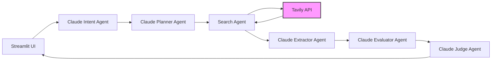
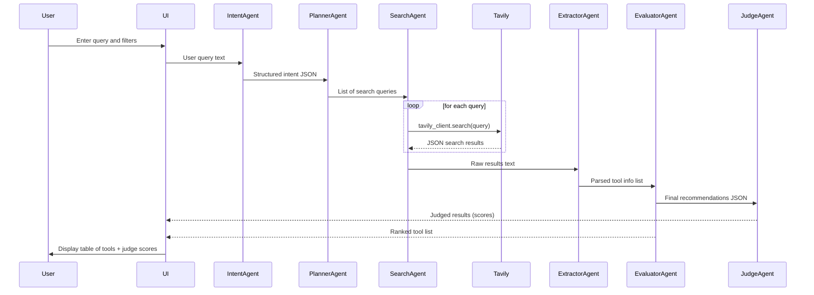

# Executive Summary

We propose a **multi-agent AI system** to help developers discover and compare productivity tools tailored to their needs. The system features a Streamlit frontend for input and results, and a Claude-based backend orchestration that employs specialized agents (Intent, Planner, Search, Extractor, Evaluator, Judge) to handle tasks. Real-time web search is enabled via Tavily’s API. Core features include intelligent **search and filtering of developer tools by category, platform, cost, etc.**, side-by-side comparisons, and personalized recommendations. Notably, an **LLM-as-Judge** module evaluates the relevance and quality of recommendations against a defined rubric, producing structured feedback.  

This design draws on best practices: it treats each agent as a “team member” with specific inputs/outputs, minimizing context bloat【32†L91-L100】. For example, one agent parses the user’s query and constraints, another generates search queries, another invokes Tavily and extracts results, and a final agent scores the output using a fixed rubric【32†L93-L101】. The result is a pipeline that “searches, filters, and discovers” tools much like existing AI tool directories【26†L4-L7】, but specialized for developer productivity. Below, we define user personas, required features (must-have, nice-to-have, experimental), detailed specs (I/O, UI, data flow, error handling, performance), agent responsibilities, integration details (Claude and Tavily usage, caching, rate limits), judge design, security/privacy, deployment steps, testing strategy, metrics, and a phased roadmap. Citations are provided for key references (Claude/Tavily examples and evaluation methodology).

---

## 1. User Personas

We identify **5–6 developer-related personas**, each with distinct needs:

- **Novice Programmer:** Early-career or self-taught developer. Needs clear tool suggestions and beginner-friendly explanations. Likely constrained by budget (prefers free/open-source) and basic experience.  
- **Experienced Engineer:** Senior developer or specialist. Needs advanced, niche tools (e.g. performance profilers, IDE plugins). Values deep comparisons and credible sources. Prefers performance and extensibility.  
- **Team Lead / Architect:** Oversees a dev team or project. Needs tools that scale for teams (collaboration, license management), integrate with existing infrastructure (CI/CD, Git). Cares about cost, security, and platform compatibility.  
- **DevOps/Infrastructure Engineer:** Focused on deployment, CI/CD, cloud, containers. Needs pipeline automation, monitoring, and security tools. Values reliability, integration APIs, and scripting support.  
- **Freelancer / Indie Dev:** Solo developer with limited budget. Seeks free or all-in-one tools (e.g. cross-platform IDEs, SaaS with generous free tier). Values simplicity, multi-language support, community help.  
- **Data Scientist / ML Engineer (optional):** Uses Python/R heavy stacks. Needs data analysis, notebooks, cloud ML platforms. Needs compatibility with data pipelines and hardware acceleration.  

Each persona’s *needs* guide our feature priorities. For example, Team Leads prioritize **comparison tables, pricing info, and integrations**, while Novice Programmers need **simple search, explanations, and ease-of-use**. The system will allow specifying constraints (free vs paid, platform) to tailor results. 

---

## 2. Core Features

We categorize features into **Must-have**, **Nice-to-have**, and **Experimental**, ranked by user impact and feasibility:

| Feature                     | Priority     | Rationale                                                  |
|-----------------------------|--------------|------------------------------------------------------------|
| **Tool Search**             | Must-have    | Core function: find tools by keyword/task. Enables all users to locate relevant tools quickly. Essential baseline.                                       |
| **Filter & Facets**         | Must-have    | Narrow results by platform (Windows/Mac/Linux), language support, budget (free vs paid), team vs solo. Crucial for relevance and usability.           |
| **Comparison Table**        | Must-have    | Side-by-side comparison (features, license, rating). Helps users evaluate options clearly. High impact on decision-making.                             |
| **Summarized Pros/Cons**    | Must-have    | Bullet points or brief summary of each tool’s strengths/weaknesses. Improves clarity, especially for novices.                                         |
| **Recommendations Ranking** | Must-have    | Rank tools by relevance to query/user constraints. E.g., “Top 3: ...”. Ensures best matches are seen first.                                            |
| **Citations/Links**         | Must-have    | Provide sources for each tool (official site, docs, reviews). Builds trust and allows deep dive.                                                     |
| **Response Explanation**    | Nice-to-have | Human-readable explanation of _why_ each tool is recommended. Supports transparency and learning.                                                     |
| **User Profile & History**  | Nice-to-have | Save preferences (languages known, tool licenses owned) and past queries for personalization. Aids returning users.                                      |
| **Peer Reviews Integration**| Nice-to-have | Aggregate ratings or quotes from places like GitHub or forums (if accessible). Adds social proof.                                                     |
| **Learning Resources Link** | Nice-to-have | For each tool, link to tutorials or docs. Helps especially novices.                                                                                    |
| **Chat/Q&A Interface**      | Experimental | Allow conversational interaction (e.g. “Why not X?”). High complexity (LLM chat flow), but innovative.                                                |
| **AI-Generated Tutorials**  | Experimental | Generate quick how-to-guide for a selected tool. Very complex but could showcase Claude’s generation.                                                  |

For example, an existing “AI Tool Finder” emphasizes “search, filter, and discover” capabilities【26†L4-L7】, which we adopt. The **trade-offs** are summarized:

| Feature              | Benefit                            | Complexity/Risk              | Category         |
|----------------------|------------------------------------|------------------------------|------------------|
| Real-time Web Search | Up-to-date info on tools            | Requires API calls (Tavily); rate limits to manage【36†L65-L68】 | Must-have       |
| Local Caching        | Faster repeated queries             | Storage management; potential staleness | Nice-to-have    |
| Multi-Agent Design   | Modular, specialized processing     | Complex orchestration        | Must-have       |
| JSON Output (Judge)  | Structured evaluation output        | Requires prompt design       | Nice-to-have    |
| Auth & Keys via ENV  | Security best practice              | Minor setup overhead         | Must-have       |

---

## 3. Detailed Feature Specifications

Below we describe the **inputs, outputs, UI elements, data flow, error handling, and performance** for each key feature.

### 3.1 Search and Filter

- **Inputs:** User enters free-text query (e.g. “API testing tool for Python on Linux”) and selects filters (checkboxes/dropdowns for language, platform, cost, team size).  
- **Outputs:** A ranked list of tools matching criteria. For each tool: name, short description, key features, license (free/paid), platform icons, and a link. Possibly rating or citation snippet.  
- **UI Elements:** 
  - A text input field (`st.text_input` or `st.text_area`) for the query.  
  - Dropdowns or multi-select (`st.selectbox`, `st.multiselect`) for filters (e.g., OS: Linux/Mac/Win; Cost: Free/Open-Source/Paid; Team: Solo/Team).  
  - A “Search” button (`st.button("Find Tools")`) to trigger the agent system.  
  - Results area showing tools in a **table or card layout** (`st.dataframe` or `st.write` with Markdown). Must support images/icons.  
  - A toggle or expander for each tool’s pros/cons (`st.expander`).  
- **Data Flow:** 
  1. User submits query + filters → frontend triggers `run_agent_system()`.  
  2. **Intent Agent** (Claude) parses query to structured form (task, constraints).  
  3. **Planner Agent** (Claude) generates 3–5 targeted search queries (e.g. “best Python API testing tools Linux free”).  
  4. **Search Agent** calls Tavily’s Search API for each query (`tavily_client.search(query)`【35†L124-L129】).  
  5. **Extractor Agent** (Claude) processes each search result to extract tool names and relevant details (snippets, links).  
  6. **Filter Agent** applies user constraints (language, platform, cost) to filter extracted tools.  
  7. **Evaluator Agent** (Claude) ranks filtered tools by relevance and user criteria, assembling pros/cons and justification.  
  8. **Judge Agent** (Claude) evaluates the assembled list using a rubric (see Section 6) and returns JSON scores.  
  9. Frontend displays ranked tools with scores, in a formatted table.  
- **Error Handling:** 
  - If **no results**: show friendly message (“No tools found; try broadening your query or removing filters.”).  
  - If **API errors or timeouts**: catch exceptions and display error (e.g. “Search service unavailable; try again later.”).  
  - If **Rate limit exceeded** from Tavily, respect `429 Retry-After` header【36†L100-L108】 and retry after delay (or throttle automatically).  
  - If **parsing fails** (e.g. Claude returns unexpected format), default to a minimal response or retry prompt.  
- **Performance Constraints:** 
  - Aim for **~5-10 second** response time. Use caching for repeated queries (e.g. memoize tool lists for identical inputs within session).  
  - Limit number of search results (e.g. top 10-20 links).  
  - Streamlit can show a spinner or progress bar during search.

### 3.2 Comparison and Summaries

- **Inputs:** Output from the Search/Filter agent steps (list of candidate tools + metadata).  
- **Outputs:** A **comparison table** summarizing key attributes (Name, License, OS, Main Features, Link). Alongside, each tool has a short summary (1–2 bullet points for pros and cons) and a final ranking position.  
- **UI Elements:** 
  - A table (`st.dataframe` or `st.table`) with columns “Tool”, “License”, “Platforms”, “Summary”.  
  - Each table row may include an expander with detailed notes or a small image/icon.  
  - A side-by-side layout if comparing exactly two tools (optional).  
- **Data Flow:** 
  - The **Evaluator Agent** (Claude) generates the summary text for each tool and decides ranking. It outputs structured data (JSON or Python dict) that the Streamlit code formats.  
  - The frontend takes this structured output and populates the table.  
- **Error Handling:** 
  - If a tool’s details are incomplete, mark missing fields with “N/A”.  
  - If Claude fails to generate summaries, fallback to displaying raw extracted description.  
- **Performance:** Rendering the table should be fast. Only a handful of tools are shown (e.g. top 3–5).

### 3.3 Personalized Recommendations (Nice-to-Have)

- **Inputs:** User profile/preferences (programming languages known, teamsize, budget) — optional profile set via UI.  
- **Outputs:** Adjusted ranking and highlighting of tools that fit profile.  
- **UI:** Checkboxes or a profile form (if implemented). A “Save Preferences” button.  
- **Data Flow:** If implemented, a **Profile Agent** would adjust the Planner or Evaluator behavior using stored prefs.  
- **Error Handling:** If no profile data, skip this step.  
- **Perf:** Caching user prefs locally (Streamlit session or SQLite) is trivial.

### 3.4 LLM-as-Judge Evaluation

- See Section 6 below for full design. In the UI, we show the judge’s scores in an “evaluation” section or expander with progress bars.  

### 3.5 Integration / Admin Features (Optional)

- **Usage Analytics:** Log each query and selection (anonymized) for improvement.  
- **Export/Share:** Allow copy or download of comparison report as PDF/Markdown.  

---

## 4. Multi-Agent Responsibilities

The system is organized as **specialized agents**, each invoked by Claude via function calls (Anthropic’s tool-use). Below are responsibilities, prompts/contracts, and tool interactions for key agents. (All agents run via Claude API calls as per the Anthropic Python SDK【15†L194-L201】.)

1. **Intent Agent (Claude)**  
   - **Role:** Parse the raw user query and filters into structured input.  
   - **Input:** Raw text (e.g. “I need a free API testing tool for Python on Linux”).  
   - **Output:** JSON `{ task: "...", language: "...", platform: "...", budget: "...", experience: "..." }`.  
   - **Prompt/Contract:** E.g. system prompt: “Parse the user’s request for developer tools. Return JSON with fields `task`, `language`, `platform`, `budget`, `teamSize`, `experience`.”  
   - **Decision Points:** None (straight parsing). If missing fields, set as `unspecified`.  
   - **Errors:** On ambiguity, pick most likely values or ask for clarification (though we prefer no extra interaction).  
   - **Tool Calls:** None.

2. **Planner Agent (Claude)**  
   - **Role:** Generate effective search query strings from parsed intent.  
   - **Input:** The JSON from Intent Agent.  
   - **Output:** A list of search query strings (e.g. 3–5 variants).  
   - **Prompt/Contract:** System prompt describing query generation (“Given the user’s structured intent, generate 3-5 web search queries that capture synonyms and relevant keywords.”).  
   - **Decision Points:** May include experience in phrasing (e.g. add “beginner-friendly” if novice).  
   - **Errors:** If output not list, wrap each sentence as separate query.  
   - **Tool Calls:** None.

3. **Search Agent (Tavily Client)**  
   - **Role:** Perform web searches using Tavily.  
   - **Input:** One search query at a time from Planner.  
   - **Output:** Raw response from Tavily (JSON with results).  
   - **Prompt/Contract:** This agent is actually a code function (in Python) calling `tavily_client.search(query)`【35†L124-L129】.  
   - **Decision Points:** For each query, fetch results. Optionally drop into deeper search (crawl) if needed.  
   - **Errors:** If Tavily returns error (network, 429), retry with backoff.  
   - **Tool Calls:** Tavily Search API (synchronous via SDK or REST). Handles its own rate-limit.  

4. **Extractor Agent (Claude)**  
   - **Role:** From raw web results, extract candidate tools and their attributes.  
   - **Input:** Combined text of titles and snippets from Tavily results.  
   - **Output:** Structured list of tools: `[{"name": "...", "description": "...", "platforms": [...], "license": "...", "url": "..."}]`.  
   - **Prompt/Contract:** System prompt telling Claude to extract tool info (names, one-liner). Possibly provide an example output format.  
   - **Decision Points:** Filter out duplicates, handle ambiguous names.  
   - **Errors:** If Claude invents a tool not in results, discard it.  
   - **Tool Calls:** Possibly use Tavily’s `extract` to fetch more info on a URL, if needed.  

5. **Evaluator Agent (Claude)**  
   - **Role:** Rank and filter the tool list based on user constraints, and generate pros/cons.  
   - **Input:** List of extracted tools + user intent JSON.  
   - **Output:** Final ordered list with reasoning. E.g. `[{"name":"ToolX","score":8.5,"pros":["..."],"cons":["..."],"rationale":"..."}]`.  
   - **Prompt/Contract:** Instruct Claude to score tools against criteria (e.g. “Rank free tools higher for a budget-conscious user”). Provide clear rubric in prompt if possible.  
   - **Decision Points:** If too many tools, drop lowest scoring ones. Decide final top-N to return.  
   - **Errors:** If outputs miss fields, retry or fill “N/A”.  
   - **Tool Calls:** Might call Tavily extract for tool specifics (e.g. fetch official site for more data) if needed.  

6. **Judge Agent (Claude)**  
   - **Role:** Evaluate the recommendation list for quality, using a predefined rubric, and output a JSON with scores and comments.  
   - **Input:** The Evaluator’s output (trend/tool list, scores, rationale).  
   - **Output:** JSON with fields like `scores: {relevance, accuracy, completeness}`, `overall_score`, `summary`, etc.  
   - **Prompt/Contract:** We will send a prompt embedding the rubric and asking for a strict JSON answer【32†L93-L100】. Example rubric might be:
     - **Relevance:** Are the recommended tools relevant to the query?  
     - **Coverage:** Does the list cover the main options?  
     - **Clarity:** Are pros/cons clear?  
   - **Decision Points:** None (straight evaluation).  
   - **Errors:** If JSON is malformed, fall back to raw text and try parsing.  
   - **Tool Calls:** No external; just Claude generation.

**Agents Flow Diagram (Mermaid):**



This depicts the **pipeline**: user query flows through Intent→Planner→Search (calls Tavily)→Extractor→Evaluator→Judge, and back to the UI.

---

## 5. Integration Details

We integrate **Claude API**, **Tavily API**, and the deployment environment as follows:

- **Claude Integration:** Use the [Anthropic Python SDK](https://platform.claude.com/docs/en/api/sdks/python)【15†L194-L201】. Store `ANTHROPIC_API_KEY` in `.env`. Example call:  
  ```python
  import os
  from anthropic import Anthropic

  client = Anthropic(api_key=os.environ.get("ANTHROPIC_API_KEY"))
  response = client.messages.create(
      model="claude-opus-4-6",
      messages=[{"role":"user","content":"Hello, Claude"}]
  )
  print(response.content)
  ```  
  (This code is from Anthropic docs【15†L194-L201】.) Configure model (e.g. `claude-opus-4-6`) per performance needs. Use the synchronous or async client; for multi-step agentic flow, sequential sync calls suffice.  

- **Tavily Integration:** Use the `tavily-python` SDK. Store `TAVILY_API_KEY` in `.env`. Example from docs:  
  ```python
  from tavily import TavilyClient
  tavily_client = TavilyClient(api_key=os.environ.get("TAVILY_API_KEY"))
  response = tavily_client.search("Who is Leo Messi?")
  print(response)
  ```  
  as shown in their Quickstart【35†L124-L129】. For each search query generated, call `search()`. Use optional parameters: e.g. `max_results`, `search_depth=1`. To extract detailed info, use `tavily_client.extract(url)`.  

- **Caching:** Implement caching at two levels: (1) Agent outputs (Streamlit `@st.cache` or Python `lru_cache` for search results by query string). (2) Claude calls results caching (if re-running same user input). Caching avoids repeated searches and Claude calls.  

- **Rate Limits:** Tavily dev keys allow **100 req/min**, prod keys **1000 req/min**【36†L63-L68】. Implement a simple rate limiter or catch HTTP 429 and respect `Retry-After` header【36†L100-L108】. For Claude, adhere to any specified rate by Anthropic; usually 3–10 rps is safe.  

- **Authentication:** Set two environment variables: `ANTHROPIC_API_KEY` and `TAVILY_API_KEY`. In Streamlit, use `st.secrets` or `python-dotenv` to load these. Ensure `.env` is in `.gitignore`.  

- **Endpoints:** Claude: use `client.messages.create()` endpoint (Anthropic SDK). Tavily: use REST endpoints via SDK (`TavilyClient.search`, `.extract`, `.crawl` if needed). 

- **Deployment Config:** On Railway/Vercel, define env vars in the project settings (Railway has a UI to set secrets). Use a `requirements.txt` (including `anthropic`, `tavily-python`, `streamlit`, etc). 

---

## 6. LLM-as-Judge Design

To ensure recommendation **quality**, we add an LLM-based evaluator after the main agent pipeline. This judge scores the output list against a rubric and returns structured JSON. Based on the LLM-as-Judge pattern【32†L93-L100】, the system prompt instructs the judge model to output strict JSON.

- **Rubric Example:**  
  1. **Relevance:** Are the tools on-topic? (1=mostly unrelated, 5=highly relevant).  
  2. **Coverage:** Are major good options included? (1=key tools missing, 5=all relevant covered).  
  3. **Clarity:** Are explanations concise and clear? (1=confusing, 5=crisp).  
  4. **Justification:** Are pros/cons supported by data or logic? (1=vague, 5=well-justified).  

- **JSON Schema:**  
  ```json
  {
    "scores": {
      "relevance": {"score": N, "reason": "..."},
      "coverage": {"score": N, "reason": "..."},
      "clarity": {"score": N, "reason": "..."},
      "justification": {"score": N, "reason": "..."}
    },
    "overall_score": N,
    "summary": "Overall assessment ...",
    "best_aspect": "..."
  }
  ```  

- **Prompt Example:** We embed the rubric in the prompt and include the actual output to evaluate. For instance:  
  ```
  System: "You are an expert reviewing developer tool recommendations..."
  User: "Evaluate this output: [trend_summary, tool list, pros/cons, references]...
           Scoring: Relevance, Coverage, Clarity, Justification (1-5).
           Return ONLY valid JSON matching the schema above."  
  ```  
  The judge agent (Claude) then generates a JSON. This mirrors known patterns of LLM-as-Judge【32†L93-L100】.

- **In UI:** After obtaining the JSON, display each criterion (e.g. with `st.metric` or progress bars) and include the judge’s reasoning. For example:
  ```python
  st.metric("Relevance", f"{judge['scores']['relevance']['score']}/5")
  st.caption(judge['scores']['relevance']['reason'])
  ```
  The judge ensures consistency and provides actionable feedback on the recommendation quality.

---

## 7. Privacy and Security

- **No Sensitive Data:** Advise users not to input confidential code or credentials. The agent deals only with tool descriptions and public info.  
- **API Key Security:** Use environment variables for Claude/Tavily keys. Do not expose them in client code. For example, use `os.getenv("ANTHROPIC_API_KEY")`【15†L194-L201】.  
- **Data Retention:** Do not store user inputs longer than necessary. If logging queries for analytics, anonymize them.  
- **HTTPS:** Communications with APIs (Claude, Tavily) are over HTTPS by default, ensuring encryption.  
- **Rate Limit Guards:** As mentioned, handle 429 responses gracefully【36†L100-L108】.  
- **Compliance:** If needed, note compliance (Tavily and Anthropic have their own policies). No personal info is fetched or stored by agents.  
- **Error Sanitization:** Do not leak stack traces or internal info to users. Show user-friendly error messages.

---

## 8. Deployment Checklist

- **Code Repo:** Push code to GitHub with a clear README. Include instructions for setting `ANTHROPIC_API_KEY` and `TAVILY_API_KEY` in a `.env` file.  
- **Railway Setup:**  
  1. Create a new Railway project, connect GitHub repo.  
  2. Set environment variables `ANTHROPIC_API_KEY` and `TAVILY_API_KEY` in Railway’s Settings (with your keys).  
  3. Ensure `requirements.txt` includes: `streamlit`, `anthropic`, `tavily-python`, `python-dotenv`, etc.  
  4. Use Railway’s Python starter (or Docker if needed). If using Streamlit, set start command to `streamlit run app.py`.  
  5. Verify memory/timeout (the default should handle a few seconds per request).  
- **Vercel (optional):** If a separate frontend is used (e.g. Next.js), deploy that to Vercel similarly (with CLAUDE key set as env var). Otherwise, Streamlit itself can serve.  
- **CI/CD:** (Optional but recommended) Use GitHub Actions: on push to main, run lint/tests, then deploy to Railway using Railway CLI or API.  
- **Monitoring:** Set up basic logging (Railway gives logs). Optionally integrate a monitoring tool (like Datadog or Railway’s monitoring) to track uptime.  

---

## 9. Testing Plan

We will implement **unit tests, integration tests, and end-to-end (E2E) tests**:

- **Unit Tests:** Test each agent function in isolation. For example:  
  - **Intent Agent:** Given a sample query string, assert correct parsed JSON.  
  - **Planner Agent:** Given intent JSON, check generation of expected queries (could compare count or include known keywords).  
  - **Evaluator Agent:** Given a small mocked tool list and constraints, verify correct filtering and ordering.  
  - **Judge Agent:** Supply fake output JSON and ensure the rubric prompt yields a JSON (maybe mock Claude).  
  Use pytest and mock API calls (monkeypatch `tavily_client.search` to return fixed results).

- **Integration Tests:** Chain multiple agents. For example, simulate a full `run_agent_system("free Python IDE Windows")` but mock Tavily and Claude responses to test data flow.  

- **E2E Tests:** Use a tool like `pytest` with `requests` or `selenium` to hit the live Streamlit UI if deployed on a test URL. Validate that an example query returns a table with expected columns. Could also use Playwright for UI testing.  

- **Sample Test Cases:**  
  | Case                             | Input                        | Expected Outcome                                               |
  |----------------------------------|------------------------------|----------------------------------------------------------------|
  | Common query                     | “free API testing Python”    | Top tools include e.g. Postman, Hoppscotch; free filter applied |
  | No result                        | “quantum compiler cocoa”     | No tools found message                                       |
  | Ambiguous query                  | “tool debugging”             | Shows general debug tools like gdb, VSCode                    |
  | Invalid input                    | empty string                 | Prompt user to enter something                                 |
  | API failure simulation           | (Tavily returns error)       | Graceful error message to user                                |

- **Edge Cases:** Very long inputs, misspelled queries (we rely on Claude to handle somewhat), timeout from Claude (should catch and retry or fail gracefully).

---

## 10. Metrics and Evaluation

We will track the following **KPIs and telemetry**:

- **User Engagement:** Number of queries made per day/week, unique users (if login added), time spent.  
- **Performance:** Response latency (API call + Claude computation time) – track average/95th percentile. Aim for <10s.  
- **Success Rate:** Fraction of queries that return a non-empty, valid result.  
- **Judge Scores:** Average judge `overall_score` over time (tracks quality of recommendations).  
- **Top Tools Click-through:** If we link to tool sites, log which tools users click.  
- **Error Rates:** Count of exceptions or failed API calls.  
- **Telemetry Implementation:** Use a lightweight solution (e.g. sending logs to stdout or using Railway’s built-in metrics). Could also hook to an analytics service via API calls.  

These metrics can be visualized on a dashboard (e.g. using Streamlit or Grafana) for team monitoring.

---

## 11. Implementation Roadmap

A phased plan (for a 2-person team) with milestones and rough hours:

| Phase        | Tasks                                      | Est. Hours (2 ppl) | Cumulative (hrs) |
|-------------|---------------------------------------------|--------------------|------------------|
| **Milestone 1: Design (8h)**  | Define problem, personas, architecture diagram, tech stack decisions. Prepare project repo. | 8 | 8 |
| **Milestone 2: Basic Skeleton (8h)** | Set up Streamlit app, orchestrator, empty agents. Add env config for Claude/Tavily keys. | 8 | 16 |
| **Milestone 3: Search Pipeline (16h)** | Implement Intent & Planner agents (Claude prompts). Integrate Tavily: code `search_agent`. Test with hardcoded prompts. | 16 | 32 |
| **Milestone 4: Extraction & Ranking (16h)** | Implement Extractor & Evaluator agents. Write prompts for tool parsing and ranking. Populate UI table with results. | 16 | 48 |
| **Milestone 5: Filtering & UI Polish (8h)** | Add UI filters and apply in Evaluator. Improve result formatting (icons, expanders). | 8 | 56 |
| **Milestone 6: LLM-as-Judge (8h)** | Design rubric. Implement Judge agent prompt. Integrate judge output and UI display. | 8 | 64 |
| **Milestone 7: Testing (16h)** | Write unit tests for agents (mocking APIs), integration tests for pipeline. Fix issues. | 16 | 80 |
| **Milestone 8: Deployment (8h)** | Deploy backend on Railway (set envs), test live. Write deployment README. Optionally set up GitHub Actions. | 8 | 88 |
| **Milestone 9: Finalization (8h)** | Write README, Loom video, fix any UX or performance issues. Prepare presentation. | 8 | 96 |

Total ~96 hours (~48 hours/person). Adjust as needed. Early prototyping (pair programming) can accelerate common parts. Continuous integration can catch issues early (e.g. GitHub Actions on push to main).

---

## 12. Feature Trade-offs (Summary Table)

| Feature              | Benefit                                          | Complexity / Cost       | Trade-offs                     |
|----------------------|--------------------------------------------------|-------------------------|--------------------------------|
| Real-time Search     | Always current data                              | Requires Tavily calls   | Rate limits, API cost          |
| Caching             | Faster repeat queries                            | Storage & stale risk   | May serve outdated info        |
| Multi-Agent System   | Specialized processing, easier to extend         | Design/coordination     | Debugging complexity          |
| Personalization      | Increased relevance, better UX                  | Profile management      | Privacy, extra dev work       |
| LLM-as-Judge        | Automated quality control (no humans needed)      | API usage / prompt design | Accurate rubric needed      |
| Streamlit Frontend   | Quick UI development, easy deployment            | Limited customization   | Less flexible than full web app |

---

## 13. Architecture Diagram

Below is a high-level architecture diagram of the system components and data flow:

```mermaid
graph TD
    subgraph Frontend
      UI[Streamlit UI]
    end
    subgraph ClaudeBackend
      I[Intent Agent] --> P[Planner Agent]
      P --> S[Search Agent]
      S --> E[Extractor Agent]
      E --> R[Evaluator Agent]
      R --> J[Judge Agent]
    end
    UI --> |"User input"| I
    J --> |"Results + Scores"| UI
    subgraph WebAPIs
      T[Tavily API]
    end
    S --> |"search() calls"| T
    T --> |"search results"| S
    note right of T: Real-time web data (search/extract)
```

This diagram shows the **multi-agent pipeline** (in the Claude backend) and interactions with the Streamlit frontend and Tavily.

---

## 14. Agent Interaction Flow (Mermaid Sequence)



This sequence diagram outlines the call order of agents from user input to final UI output, including Tavily and judge steps.

---

# References

- Claude API usage (Anthropic Python SDK examples)【15†L194-L201】  
- Tavily Python SDK usage (search example)【35†L124-L129】  
- Tavily rate limits (100 RPM dev, 1000 RPM prod)【36†L65-L68】  
- AI Tool Finder example (“Search, filter, and discover” tools)【26†L4-L7】  
- LLM-as-Judge methodology【32†L93-L100】  

